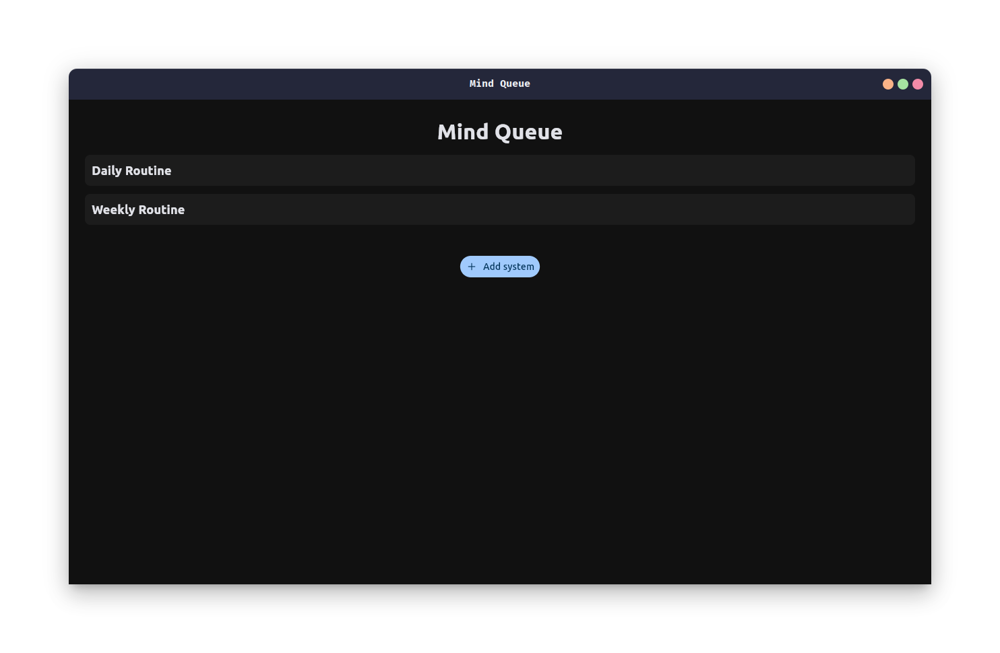
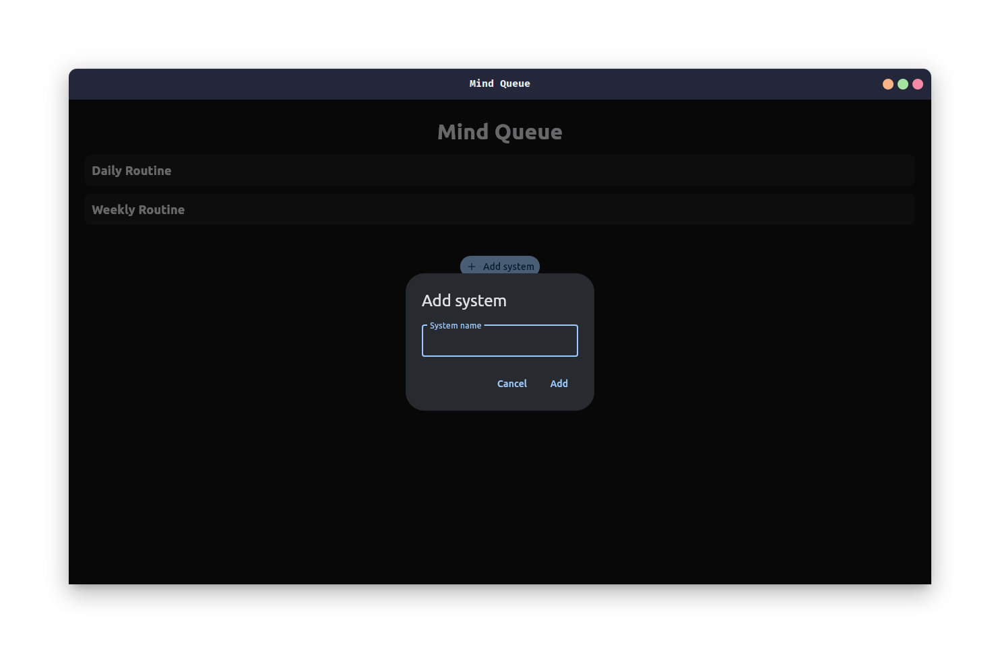
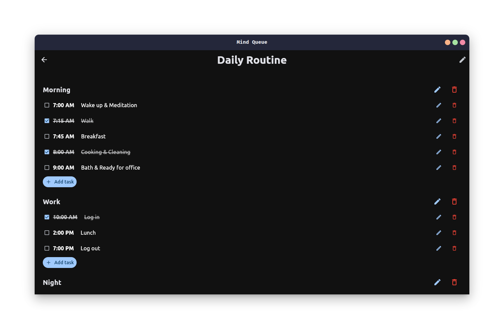
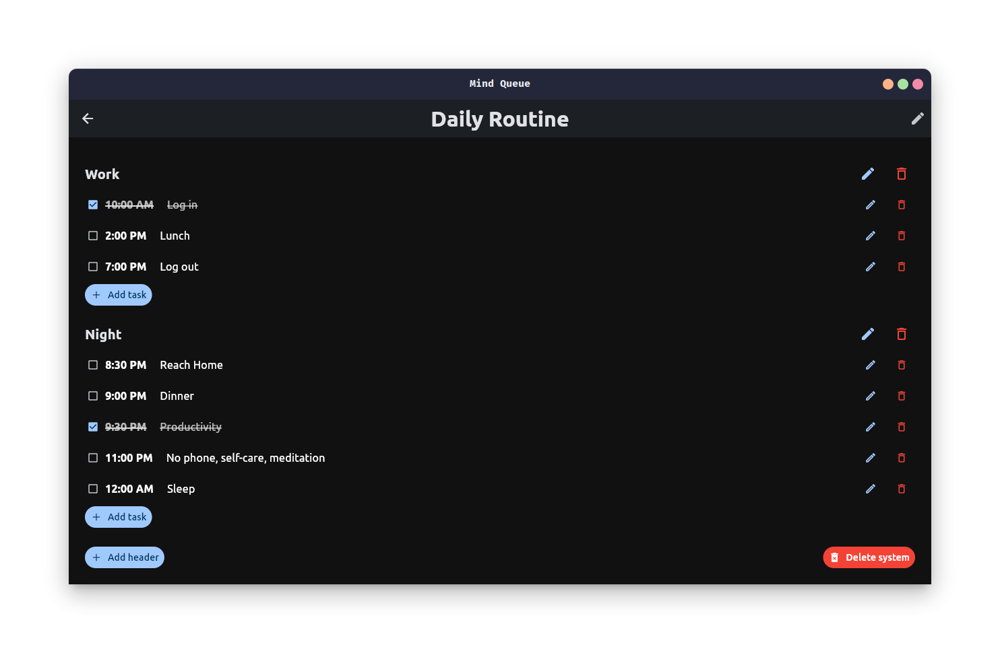
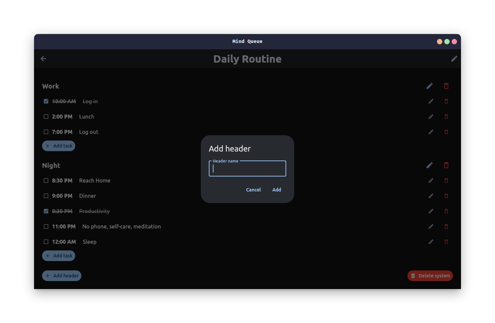
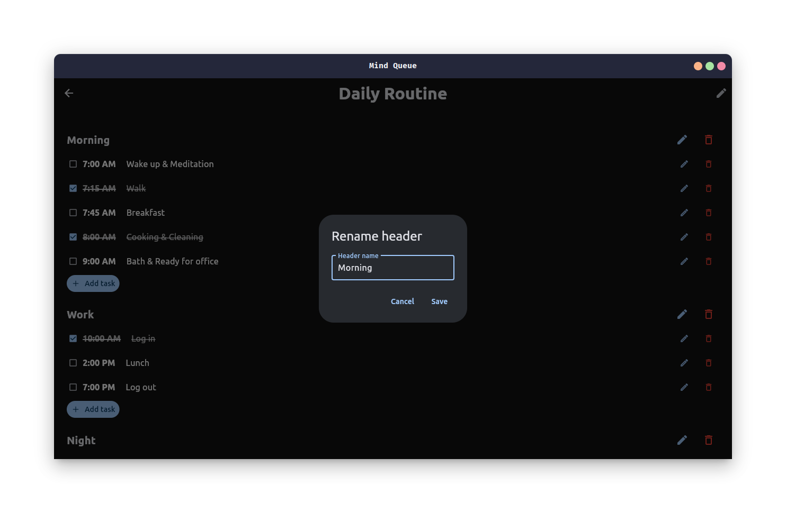
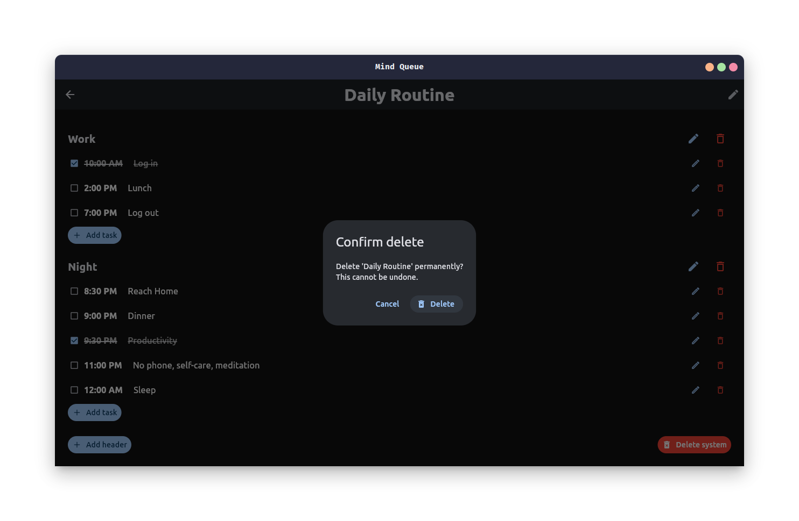

# **Mind Queue**

Mind Queue is a minimalist productivity app built with **Flet (Python + Flutter UI)**.
It helps you organize your life into **Systems → Headers → Tasks**, with a focus on simplicity, speed, and clarity.

---

## **Features**

* Create / edit / delete multiple **systems**
* Add / rename / delete **headers**
* Add / edit / delete **tasks**
* Mark tasks **done / undone**
* Confirmation dialog before deleting a system
* Clean dark UI
* Persistent local storage using `data.json` (for now)

---

## **Controls**

| Action        | Location                            |
| ------------- | ----------------------------------- |
| Add system    | Dashboard                           |
| Open system   | Click a system card                 |
| Add header    | Bottom of system page               |
| Add task      | At the end of each header           |
| Edit          | Pencil icon                         |
| Delete        | Trash icon                          |
| Delete system | Bottom red button with confirmation |
| Toggle done   | Checkbox                            |

---

## **How It Works**

| Level  | Example                     | Purpose                     |
| ------ | --------------------------- | --------------------------- |
| System | *Daily Routine*             | Entire workflow             |
| Header | *Morning / Work / Night*    | Sections inside a system    |
| Task   | *Exercise, Coding, Reading* | Individual actionable items |

---

## **Screenshots**

#### 1. Dashboard - System List


#### 2. Add System


#### 3. Open System


#### 4. Open System


#### 5. Rename System


#### 6. Add Header


#### 7. Rename Header


#### 8. Add Task


#### 9. Rename Task


#### 10. Delete System


---

## **Data Storage**

All data is stored locally in `data.json`:

```json
{
  "SystemName": {
    "HeaderName": [
      ["TaskTitle", "Description", false]
    ]
  }
}
```

---

## **Run the App**

### **Install dependencies**

```bash
virtualenv venv
source venv/bin/activate
pip install -r requirements.txt
```

### **Run**

```bash
python main.py
```

Make sure a `data.json` file exists. If not, create a demo one:

```json
{
    "Daily Routine": {
        "Morning": [
            ["7:00 AM", "Wake up & Meditation", false],
            ["7:15 AM", "Walk", true],
            ["7:45 AM", "Breakfast", false],
            ["8:00 AM", "Cooking & Cleaning", true],
            ["9:00 AM", "Bath & Ready for office", false]
        ],
        "Work": [
            ["10:00 AM", "Log in", true],
            ["2:00 PM", "Lunch", false],
            ["7:00 PM", "Log out", false]
        ],
        "Night": [
            ["8:30 PM", "Reach Home", false],
            ["9:00 PM", "Dinner", false],
            ["9:30 PM", "Productivity", true],
            ["11:00 PM", "No phone, self-care, meditation", false],
            ["12:00 AM", "Sleep", false]
        ]
    }
}
```

---

## **Future Enhancements**

* Daily auto reset
* Progress tracking & statistics
* Cloud sync / login
* Store data to sqlite3

---

## **License**

Free to use, customize, and improve.

---
